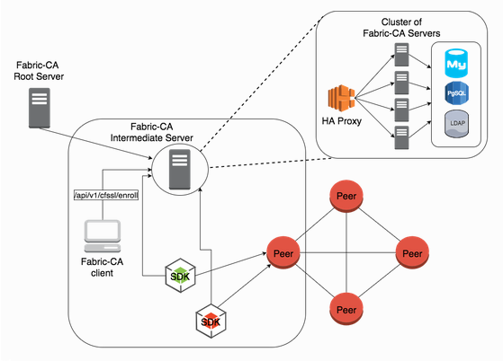
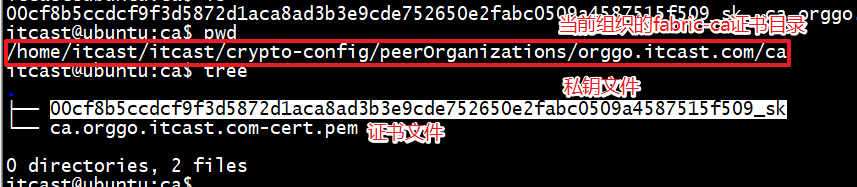

## 1. 链码

```go
// chaincode/go/test1/test.go -> 对应链码名testcc
package main
import {
}
type Test struct{
}
func (t* Test)Init();
func (t* Test)Invoke();	// 业务逻辑1
func main(){
    
}
// chaincode/go/test2/test1.go -> 链码名: testcc1
package main
import {
}
type Test struct{
}
func (t* Test)Init();
func (t* Test)Invoke();	// 业务逻辑2
func main(){
    
}
// 安装流程
- 安装test1目录中的链码
- 安装test2目录中的链码
```

背书策略

```shell
# 指定背书策略
peer chaincode instantiate -o oraderer.test.com:7050 -C mychannel -n mycc —v 1.0 -c '{"Args":["init", "a", "100", "b", "200"]}' -P "AND ('OrgGoMSP.member', 'OrgCppMSP.member')" 
# 调用
# 调用示例
$ peer chaincode invoke -o orderer.itcast.com:7050  -C mychannel -n testcc --tls true --cafile /opt/gopath/src/github.com/hyperledger/fabric/peer/crypto/ordererOrganizations/itcast.com/orderers/orderer.itcast.com/msp/tlscacerts/tlsca.itcast.com-cert.pem --peerAddresses peer0.orggo.itcast.com:7051 --tlsRootCertFiles /opt/gopath/src/github.com/hyperledger/fabric/peer/crypto/peerOrganizations/orggo.itcast.com/peers/peer0.orggo.itcast.com/tls/ca.crt --peerAddresses peer0.orgcpp.itcast.com:7051 --tlsRootCertFiles /opt/gopath/src/github.com/hyperledger/fabric/peer/crypto/peerOrganizations/orgcpp.itcast.com/peers/peer0.orgcpp.itcast.com/tls/ca.crt -c '{"Args":["invoke","a","b","10"]}'

AND("org1.member", "org2.member")
OR("org1.member", "org2.member")
AND(" .member", OR("org1.member", "org2.member"))
```

main函数编写

```go
func main() { 
    // SimpleChaincode 自定义 的结构体
    err := shim.Start(new(SimpleChaincode))	// 最重要的一句话
    if err != nil {
    fmt.Printf("Error starting Simple chaincode: %s", err)
    }
}
如果要自定义函数,函数格式
func (t* xxx) funcName(stub shim.ChaincodeStubInterface, args []string) pb.Response {
}
```

## 2. Fabric 账号

### 2.1 Fabric账号

- **Fabric账号**

  > 1. 账号是什么?
  >
  >    <font color="red">Fabric中的账号实际上是根据PKI规范生成的一组证书和秘钥文件</font>
  >
  > 2. fabric中账号的作用
  >
  >    - 保证记录在区块链中的数据具有不可逆、不可篡改
  >    - Fabric中每条交易都会加上发起者的标签（签名证书），同时用发起人的私钥进行加密
  >    - 如果交易需要其他组织的节点提供背书功能，那么背书节点也会在交易中加入自己的签名

  ```shell
  # Fabric中的完整账号结构
  .
  ├── Admin@orggo.itcast.com
  │   ├── msp
  │   │   ├── admincerts
  │   │   │   └── Admin@orggo.itcast.com-cert.pem
  │   │   ├── cacerts
  │   │   │   └── ca.orggo.itcast.com-cert.pem
  │   │   ├── keystore
  │   │   │   └── a2f15f92d1b1733a9a901aa4e6fa6d5910248a967b13a00521ba26068a2bc592_sk
  │   │   ├── signcerts
  │   │   │   └── Admin@orggo.itcast.com-cert.pem
  │   │   └── tlscacerts
  │   │       └── tlsca.orggo.itcast.com-cert.pem
  │   └── tls
  │       ├── ca.crt
  │       ├── client.crt
  │       └── client.key
  ├── User1@orggo.itcast.com
  │   ├── msp
  │   │   ├── admincerts
  │   │   │   └── User1@orggo.itcast.com-cert.pem
  │   │   ├── cacerts
  │   │   │   └── ca.orggo.itcast.com-cert.pem
  │   │   ├── keystore
  │   │   │   └── 889f0029925920dcff610239140bda797e102cda8072a89e2f46c4798bdb5c1d_sk
  │   │   ├── signcerts
  │   │   │   └── User1@orggo.itcast.com-cert.pem
  │   │   └── tlscacerts
  │   │       └── tlsca.orggo.itcast.com-cert.pem
  │   └── tls
  │       ├── ca.crt
  │       ├── client.crt
  │       └── client.key
  ```

  > - <font color="red">msp文件夹中内容中主要存放签名用的证书文件和加密用的私钥文件。</font>
  >   - admincerts：管理员证书。
  >   - cacerts：根CA服务器的证书。
  >   - keystore：节点或者账号的私钥。
  >   - signcerts：符合x.509的节点或者用户证书文件。
  >   - tlscacerts：TLS根CA的证书。
  > - <font color="red">tls 文件夹中存放加密通信相关的证书文件。</font>

### 2.2 什么地方需要 Fabric 账号

  - <font color="red">启动orderer</font>

    > 启动orderer的时候我们需要通过环境变量或者配置文件给当前启动的Orderer设定相应的账号。

    ```shell
    # 环境变量账号： -> 该路径为宿主机上的路径, 非docker启动的orderer节点内部挂载路径
    ORDERER_GENERAL_LOCALMSPDIR=./crypto-config/ordererOrganizations/itcast.com/orderers/orderer.itcast.com/msp
    # 账号目录信息
    $ tree msp/
    msp/
    ├── admincerts
    │   └── Admin@itcast.com-cert.pem
    ├── cacerts
    │   └── ca.itcast.com-cert.pem
    ├── keystore
    │   └── 4968fd5b3fa14639ba61ec97f745b2e0ce5592e54838493d965a08ac7ad1c8e7_sk
    ├── signcerts
    │   └── orderer.itcast.com-cert.pem
    └── tlscacerts
        └── tlsca.itcast.com-cert.pem
    ```

  - <font color="red">启动peer</font>

    > 启动peer的时候我们需要通过环境变量或者配置文件给当前启动的peer设定相应的账号。

    ```shell
    # 环境变量账号： -> 该路径为宿主机上的路径, 非docker启动的orderer节点内部挂载路径
    CORE_PEER_MSPCONFIGPATH=crypto-config/peerOrganizations/orggo.itcast.com/peers/peer0.orggo.itcast.com/msp
    # 账号目录信息
    $ tree msp/
    msp/
    ├── admincerts
    │   └── Admin@orggo.itcast.com-cert.pem
    ├── cacerts
    │   └── ca.orggo.itcast.com-cert.pem
    ├── config.yaml
    ├── keystore
    │   └── a3a19feb11cac708a038d115d26cf96247bcc5821bca3f2b8e9d07847604268b_sk
    ├── signcerts
    │   └── peer0.orggo.itcast.com-cert.pem
    └── tlscacerts
        └── tlsca.orggo.itcast.com-cert.pem
    ```

  - <font color="red">创建channel</font>

    > channel是fabric中的重要组成部分, 创建channel也是需要账号的. 

    ```shell
    # 环境变量账号： -> 该路径为宿主机上的路径, 非docker启动的orderer节点内部挂载路径
    # 在客户端中做的, 客户端要有一个用户的账号信息
    CORE_PEER_MSPCONFIGPATH=crypto-config/peerOrganizations/orggo.itcast.com/users/Admin@orggo.itcast.com/msp
    # 账号目录信息
    $ tree msp/
    msp/
    ├── admincerts
    │   └── Admin@orggo.itcast.com-cert.pem
    ├── cacerts
    │   └── ca.orggo.itcast.com-cert.pem
    ├── keystore
    │   └── a2f15f92d1b1733a9a901aa4e6fa6d5910248a967b13a00521ba26068a2bc592_sk
    ├── signcerts
    │   └── Admin@orggo.itcast.com-cert.pem
    └── tlscacerts
        └── tlsca.orggo.itcast.com-cert.pem
    ```

  > 通过上边的内容我们可以发现这些账号的内容是一样的, 都包含是5个不同的文件, 但是仔细观察会发现在文件路径上还是有一些区别的。我们来对比一下：

  ```shell
  # Orderer 启动路径
  crypto-config/ordererOrganizations/itcast.com/orderers/orderer.itcast.com/msp
  # Peer启动的账号路径
  crypto-config/peerOrganizations/orggo.itcast.com/peers/peer0.orggo.itcast.com/msp
  # 创建channel的账号路径
  crypto-config/peerOrganizations/orggo.itcast.com/users/Admin@orggo.itcast.com/msp
  ```

  > <font color="red">我们可以发现Peer和Orderer都有属于自己的账号，创建Channel使用的是用户账号。其中Peer和创建Channel的用户账号属于某个组织，而Orderer的启动账号只属于他自己。这里特别注意，用户账号在很多操作中都会用到，而且很多操作的错误都是用户账号的路径设置不当而引起的。</font>

### 2.3 Fabric-ca（动态添加用户）

> fabric-ca 项目是专门为了解决Fabric账号问题而发起的一个开源项目, 它非常完美的解决了fabric账号生成的问题。fabric-ca项目由 fabric-server 和fabric-client这两个模块组成。其中fabric-server在 fabric中占有非常重要的作用。**我们使用`cryptogen`命令可以同配置文件生成一些账号信息, 但是如果有动态添加账号的需求, 就无法满足, 所以这个时候我们就应该在项目中引入fabric-ca。**

Fabric-CA Root Server 是整个联盟链里面（fabric网络中）受信任的认证机构。

Fabric-CA 可以连接关系型数据库

部署项目的时候在每个组织里部署一个Fabric-CA服务器




> 上图中Fabric CA提供了两种访问方式调用Server服务
>
> - 通过Fabric-Client调用
> - 通过SDK调用 （node.js，java， go）
>
> 通常情况下， 一个组织会对应一个fabric-server服务器， 下面介绍如何将fabric-server加入到网络中
>
> 在一个fabric中有多个组织, fabric-Ca如何部署?
>
> - 要在每个组织中部署一个fabric-ca服务器, 给当前组织注册新用户（这样的话能保证组织里面的任意一个用户可以操作组织里面的任意一个peer节点）
>
> SDK先去fabric-ca中注册一个账号，然后在登录操作peer节点

#### 2.3.1 将fabric-ca加入到网络

在docker-compose启动使用的配置文件`docker-compos.yam`中添加如下配置项:

```yaml
version: '2'

volumes:
  orderer.example.com:
  peer0.org1.example.com:
  peer0.org2.example.com:

networks:
  byfn:

services:
###################### 添加的内容 - START #########################
  ca.example.com: # -> fabric-ca的服务器名, 随便起名
    image: hyperledger/fabric-ca:latest # fabric-ca的镜像文件
    environment:
      # fabric-ca容器中的home目录
      - FABRIC_CA_HOME=/etc/hyperledger/fabric-ca-server
      - FABRIC_CA_SERVER_CA_NAME=ca.example.com	# fabric-ca服务器的名字, 自己起
      # fabric-ca服务器证书文件目录中的证书文件
      # 明确当前fabric-ca属于哪个组织
      - FABRIC_CA_SERVER_CA_CERTFILE=/etc/hyperledger/fabric-ca-server-config/ca.org1.example.com-cert.pem
      # fabric-ca服务器的私钥文件
      - FABRIC_CA_SERVER_CA_KEYFILE=/etc/hyperledger/fabric-ca-server-config/ee54a6cc9868ffa72f0556895020739409dc69da844628ae804934b7d7f68e92_sk

    ports:
      - "7054:7054"	# fabric-ca服务器绑定的端口
    # 启动fabric-ca-server服务
    # admin:123456
    #  -- admin: fabric-ca-server的登录用户名
    #  -- 123456: fabric-ca-server的登录密码
    command: sh -c 'fabric-ca-server start -b admin:123456'
    volumes:
      - ./crypto-config/peerOrganizations/org1.example.com/ca/:/etc/hyperledger/fabric-ca-server-config
    container_name: ca.example.com	# 容器名, 自己指定
    networks:
      - byfn	# 工作的网络
      
 ca.example1.com: # -> fabric-ca的服务器名, 随便起名
    image: hyperledger/fabric-ca:latest # fabric-ca的镜像文件
    environment:
    	# fabric-ca容器中的home目录
      - FABRIC_CA_HOME=/etc/hyperledger/fabric-ca-server
      - FABRIC_CA_SERVER_CA_NAME=ca.example1.com	# fabric-ca服务器的名字, 自己起
      # fabric-ca服务器证书文件目录中的证书文件
      # 明确当前fabric-ca属于哪个组织
      - FABRIC_CA_SERVER_CA_CERTFILE=/etc/hyperledger/fabric-ca-server-config/ca.org2.example.com-cert.pem
      # fabric-ca服务器的私钥文件
      - FABRIC_CA_SERVER_CA_KEYFILE=/etc/hyperledger/fabric-ca-server-config/ee54a6cc9868ffa72f0556895020739409dc69da844628ae804934b7d7f68e92_sk

    ports:
      - 8054:7054"	# fabric-ca服务器绑定的端口
    # 启动fabric-ca-server服务
    # admin:123456
    #  -- admin: fabric-ca-server的登录用户名
    #  -- 123456: fabric-ca-server的登录密码
    command: sh -c 'fabric-ca-server start -b admin:123456'
    volumes:
      - ./crypto-config/peerOrganizations/org2.example.com/ca/:/etc/hyperledger/fabric-ca-server-config
    container_name: ca.example1.com	# 容器名, 自己指定
    networks:
      - byfn	# 工作的网络
###################### 添加的内容 - END #########################
  orderer.example.com:
    extends:
      file:   docker-compose-base.yaml
      service: orderer.example.com
    container_name: orderer.example.com
    networks:
      - byfn

  peer0.org1.example.com:
    container_name: peer0.org1.example.com
    extends:
      file:  docker-compose-base.yaml
      service: peer0.org1.example.com
    networks:
      - byfn

  peer0.org2.example.com:
    container_name: peer0.org2.example.com
    extends:
      file:  docker-compose-base.yaml
      service: peer0.org2.example.com
    networks:
      - byfn

  cli:
    container_name: cli
    image: hyperledger/fabric-tools:latest
    tty: true
    stdin_open: true
    environment:
      - GOPATH=/opt/gopath
      - CORE_VM_ENDPOINT=unix:///host/var/run/docker.sock
      #- CORE_LOGGING_LEVEL=DEBUG
      - CORE_LOGGING_LEVEL=INFO
      - CORE_PEER_ID=cli
      - CORE_PEER_ADDRESS=peer0.org1.example.com:7051
      - CORE_PEER_LOCALMSPID=Org1MSP
      - CORE_PEER_TLS_ENABLED=true
      - CORE_PEER_TLS_CERT_FILE=/opt/gopath/src/github.com/hyperledger/fabric/peer/crypto/peerOrganizations/org1.example.com/peers/peer0.org1.example.com/tls/server.crt
      - CORE_PEER_TLS_KEY_FILE=/opt/gopath/src/github.com/hyperledger/fabric/peer/crypto/peerOrganizations/org1.example.com/peers/peer0.org1.example.com/tls/server.key
      - CORE_PEER_TLS_ROOTCERT_FILE=/opt/gopath/src/github.com/hyperledger/fabric/peer/crypto/peerOrganizations/org1.example.com/peers/peer0.org1.example.com/tls/ca.crt
      - CORE_PEER_MSPCONFIGPATH=/opt/gopath/src/github.com/hyperledger/fabric/peer/crypto/peerOrganizations/org1.example.com/users/Admin@org1.example.com/msp
    working_dir: /opt/gopath/src/github.com/hyperledger/fabric/peer
    command: /bin/bash
    volumes:
        - /var/run/:/host/var/run/
        - ./chaincode/:/opt/gopath/src/github.com/chaincode
        - ./crypto-config:/opt/gopath/src/github.com/hyperledger/fabric/peer/crypto/
        - ./scripts:/opt/gopath/src/github.com/hyperledger/fabric/peer/scripts/
        - ./channel-artifacts:/opt/gopath/src/github.com/hyperledger/fabric/peer/channel-artifacts
    depends_on:
      - orderer.example.com
      - peer0.org1.example.com
      - peer0.org2.example.com
    networks:
      - byfn
```



#### 2.3.2 编写node.js客户端

- 初始化node.js项目

  ```shell
  # 创建一个编写node.js客户端的目录, 并进入
  # 1. 执行npm init 生成package.json文件, 用于保存更新项目依赖的第三方模块
  #    要求输入的信息, 如果你懒, 直接回车就可以了
  # package.json配置说明: https://blog.csdn.net/Aurora100/article/details/78590346
  $ npm init
  This utility will walk you through creating a package.json file.
  It only covers the most common items, and tries to guess sensible defaults.
  
  See `npm help json` for definitive documentation on these fields
  and exactly what they do.
  
  Use `npm install <pkg>` afterwards to install a package and
  save it as a dependency in the package.json file.
  
  Press ^C at any time to quit.
  package name: (nodejs) 
  version: (1.0.0) 
  description: 
  entry point: (index.js) 
  test command: 
  git repository: 
  keywords: 
  author: 
  license: (ISC) 
  About to write to /home/itcast/nodejs/package.json:
  
  {
    "name": "nodejs",
    "version": "1.0.0",
    "description": "",
    "main": "index.js",
    "scripts": {
      "test": "echo \"Error: no test specified\" && exit 1"
    },
    "author": "",
    "license": "ISC"
  }
  
  
  Is this ok? (yes) 
  ```

  ```shell
  # 接下来执行如下命令, 安装第三方依赖库:
  npm install --save fabric-ca-client
  npm install --save fabric-client
  npm install --save grpc
  # 安装过程中, 提示如下log信息, 无需理会
  npm WARN nodejs@1.0.0 No description
  npm WARN nodejs@1.0.0 No repository field.
  ```

- 客户端参考API

  ```http
  https://fabric-sdk-node.github.io/release-1.3/index.html
  ```

## 3. Solo多机多节点部署

所有的节点分离部署, 每台主机上有一个节点

|  名称   |       IP        |      Hostname      | 组织机构 |
| :-----: | :-------------: | :----------------: | :------: |
| orderer | 192.168.247.129 | orderer.itcast.com | Orderer  |
|  peer0  | 192.168.247.141 |  peer0.orggo.com   |  OrgGo   |
|  peer1  |                 |  peer1.orggo.com   |  OrgGo   |
|  peer0  | 192.168.247.131 |  peer0.orgcpp.com  |  OrgCpp  |
|  peer1  |                 |  peer1.orgcpp.com  |  OrgCpp  |

- 准备工作 - 创建工作目录

  ```shell
  1. n台主机需要创建一个名字相同的工作目录（必须一样，因为后面的节点的网络名必须和这个目录名一样，比如都叫testwork；如果不一样，节点之间通信就无法正常访问）
      # 192.168.247.129
      mkdier ~/testwork
      # 192.168.247.141
      mkdier ~/testwork
      # 192.168.247.131
      mkdier ~/testwork
  ```

- 编写配置文件 -> 生成证书的

  ```yaml
  # crypto-config.yaml -> 名字可以改
  
  ```

- 生成通道文件和创始块文件

  ```yaml
  # configtx.yaml -> 名字不能变
  
  ```

### 3.1 部署 orderer 排序节点

- 编写orderer节点启动的docker-compose.yaml配置文件

  ```yaml
  version: '2'
  
  services:
    orderer.test.com:
      container_name: orderer.test.com
      image: hyperledger/fabric-orderer:latest
      environment:
        - CORE_VM_DOCKER_HOSTCONFIG_NETWORKMODE=testwork_default
        - ORDERER_GENERAL_LOGLEVEL=INFO
        - ORDERER_GENERAL_LISTENADDRESS=0.0.0.0
        - ORDERER_GENERAL_LISTENPORT=7050
        - ORDERER_GENERAL_GENESISMETHOD=file
        - ORDERER_GENERAL_GENESISFILE=/var/hyperledger/orderer/orderer.genesis.block
        - ORDERER_GENERAL_LOCALMSPID=OrdererMSP
        - ORDERER_GENERAL_LOCALMSPDIR=/var/hyperledger/orderer/msp
        # enabled TLS
        - ORDERER_GENERAL_TLS_ENABLED=true
        - ORDERER_GENERAL_TLS_PRIVATEKEY=/var/hyperledger/orderer/tls/server.key
        - ORDERER_GENERAL_TLS_CERTIFICATE=/var/hyperledger/orderer/tls/server.crt
        - ORDERER_GENERAL_TLS_ROOTCAS=[/var/hyperledger/orderer/tls/ca.crt]
      working_dir: /opt/gopath/src/github.com/hyperledger/fabric
      command: orderer
      volumes:
      - ./channel-artifacts/genesis.block:/var/hyperledger/orderer/orderer.genesis.block
      - ./crypto-config/ordererOrganizations/test.com/orderers/orderer.test.com/msp:/var/hyperledger/orderer/msp
      - ./crypto-config/ordererOrganizations/test.com/orderers/orderer.test.com/tls/:/var/hyperledger/orderer/tls
      networks:
          default:
            aliases:
              - testwork  # 这个名字使用当前配置文件所在的目录 的名字
      ports:
        - 7050:7050
  ```

### 3.2 部署 peer0.orggo 节点

- 切换到peer0.orggo主机 - 192.168.247.141

- 进入到 `~/testwork`

- 拷贝文件

  ```shell
  $ tree -L 1
  .
  ├── channel-artifacts
  └── crypto-config
  ```

- 编写 `docker-compose.yaml`配置文件

  ```yaml
  version: '2'
  
  services:
  
      peer0.orgGo.test.com:
        container_name: peer0.orgGo.test.com
        image: hyperledger/fabric-peer:latest
        environment:
          - CORE_VM_ENDPOINT=unix:///host/var/run/docker.sock
          - CORE_VM_DOCKER_HOSTCONFIG_NETWORKMODE=testwork_default
          - CORE_LOGGING_LEVEL=INFO
          #- CORE_LOGGING_LEVEL=DEBUG
          - CORE_PEER_GOSSIP_USELEADERELECTION=true
          - CORE_PEER_GOSSIP_ORGLEADER=false
          - CORE_PEER_PROFILE_ENABLED=true
          - CORE_PEER_LOCALMSPID=OrgGoMSP
          - CORE_PEER_ID=peer0.orgGo.test.com
          - CORE_PEER_ADDRESS=peer0.orgGo.test.com:7051
          - CORE_PEER_GOSSIP_BOOTSTRAP=peer0.orgGo.test.com:7051
          - CORE_PEER_GOSSIP_EXTERNALENDPOINT=peer0.orgGo.test.com:7051
          # TLS
          - CORE_PEER_TLS_ENABLED=true
          - CORE_PEER_TLS_CERT_FILE=/etc/hyperledger/fabric/tls/server.crt
          - CORE_PEER_TLS_KEY_FILE=/etc/hyperledger/fabric/tls/server.key
          - CORE_PEER_TLS_ROOTCERT_FILE=/etc/hyperledger/fabric/tls/ca.crt
        volumes:
          - /var/run/:/host/var/run/
          - ./crypto-config/peerOrganizations/orgGo.test.com/peers/peer0.orgGo.test.com/msp:/etc/hyperledger/fabric/msp
          - ./crypto-config/peerOrganizations/orgGo.test.com/peers/peer0.orgGo.test.com/tls:/etc/hyperledger/fabric/tls
        working_dir: /opt/gopath/src/github.com/hyperledger/fabric/peer
        command: peer node start
        networks:
          default:
            aliases:
              - testwork
        ports:
          - 7051:7051
          - 7053:7053
        extra_hosts:  # 声明域名和IP的对应关系
          - "orderer.test.com:192.168.247.129"
          
      cli:
        container_name: cli
        image: hyperledger/fabric-tools:latest
        tty: true
        stdin_open: true
        environment:
          - GOPATH=/opt/gopath
          - CORE_VM_ENDPOINT=unix:///host/var/run/docker.sock
          #- CORE_LOGGING_LEVEL=DEBUG
          - CORE_LOGGING_LEVEL=INFO
          - CORE_PEER_ID=cli
          - CORE_PEER_ADDRESS=peer0.orgGo.test.com:7051
          - CORE_PEER_LOCALMSPID=OrgGoMSP
          - CORE_PEER_TLS_ENABLED=true
          - CORE_PEER_TLS_CERT_FILE=/opt/gopath/src/github.com/hyperledger/fabric/peer/crypto/peerOrganizations/orgGo.test.com/peers/peer0.orgGo.test.com/tls/server.crt
          - CORE_PEER_TLS_KEY_FILE=/opt/gopath/src/github.com/hyperledger/fabric/peer/crypto/peerOrganizations/orgGo.test.com/peers/peer0.orgGo.test.com/tls/server.key
          - CORE_PEER_TLS_ROOTCERT_FILE=/opt/gopath/src/github.com/hyperledger/fabric/peer/crypto/peerOrganizations/orgGo.test.com/peers/peer0.orgGo.test.com/tls/ca.crt
          - CORE_PEER_MSPCONFIGPATH=/opt/gopath/src/github.com/hyperledger/fabric/peer/crypto/peerOrganizations/orgGo.test.com/users/Admin@orgGo.test.com/msp
        working_dir: /opt/gopath/src/github.com/hyperledger/fabric/peer
        command: /bin/bash
        volumes:
            - /var/run/:/host/var/run/
            - ./chaincode/:/opt/gopath/src/github.com/chaincode
            - ./crypto-config:/opt/gopath/src/github.com/hyperledger/fabric/peer/crypto/
            - ./channel-artifacts:/opt/gopath/src/github.com/hyperledger/fabric/peer/channel-artifacts
        depends_on:   # 启动顺序
          - peer0.orgGo.test.com
        
        networks:
            default:
              aliases:
                - testwork
        extra_hosts:
          - "orderer.test.com:192.168.247.129"
          - "peer0.orgGo.test.com:192.168.247.141"
  ```

- 在 `~/testwork`创建了一个子目录`chaincode`, 并将链码文件放进去

- 启动容器

  ```shell
  $ docker-compose up -d
  ```

- 进入到客户端容器中

  - 创建通道

    ```shell
    $ peer channel create -o orderer.test.com:7050 -c testchannel -f ./channel-artifacts/channel.tx --tls true --cafile /opt/gopath/src/github.com/hyperledger/fabric/peer/crypto/ordererOrganizations/test.com/msp/tlscacerts/tlsca.test.com-cert.pem
    ```

  - 将当前节点加入到通道中

    ```shell
    $ peer channel join -b testchannel.block
    ```

  - 安装链码

    ```shell
    peer chaincode install -n testcc -v 1.0 -l golang -p github.com/chaincode
    ```

  - 初始化链码

  - 将生成的通道文件 `testchannel.block` 从cli容器拷贝到宿主机

    ```shell
    # 拷贝操作要在宿主机中进行
    $ docker cp cli:/opt/gopath/src/github.com/hyperledger/fabric/peer/testchannel.block ./
    ```

### 3.3 部署 peer0.orgcpp 节点

- 切换到peer0.orgcpp主机 - 192.168.247.131

- 进入到 `~/testwork`

- 拷贝文件

  ```shell
  $ tree -L 1
  .
  ├── channel-artifacts
  └── crypto-config
  ```

  - 通道块文件 从宿主机 -> 当前的peer0.orgcpp上

    ```shell
    # 为了方便操作可以将文件放入到客户端容器挂载的目录中
    $ mv testchannel.block channel-artifacts/
    ```

- 编写 `docker-compose.yaml`配置文件

- 启动当前节点

- 进入到操作该节点的客户端中

  - 加入到通道中
  - 安装链码
```
peer chaincode instantiate -o orderer.test.com:7050 --tls true --cafile /opt/gopath/src/github.com/hyperledger/fabric/peer/crypto/ordererOrganizations/test.com/msp/tlscacerts/tlsca.test.com-cert.pem -C testchannel -n testcc -l golang -v 1.0 -c '{"Args":["init","a","100","b","200"]}' -P "AND ('OrgGoMSP.member', 'OrgCppMSP.member')"
```

### 3.4查询结果
```
peer chaincode query -C testchannel -n testcc -c '{"Args":["query","a"]}'
```

### 3.5调用方法修改数据

- 完整调用示例
```
$ peer chaincode invoke -o orderer.test.com:7050  -C testchannel -n testcc --tls true --cafile /opt/gopath/src/github.com/hyperledger/fabric/peer/crypto/ordererOrganizations/test.com/orderers/orderer.test.com/msp/tlscacerts/tlsca.test.com-cert.pem --peerAddresses peer0.OrgGo.test.com:7051 --tlsRootCertFiles /opt/gopath/src/github.com/hyperledger/fabric/peer/crypto/peerOrganizations/OrgGo.test.com/peers/peer0.OrgGo.test.com/tls/ca.crt --peerAddresses peer0.orgcpp.test.com:7051 --tlsRootCertFiles /opt/gopath/src/github.com/hyperledger/fabric/peer/crypto/peerOrganizations/orgcpp.test.com/peers/peer0.orgcpp.test.com/tls/ca.crt -c '{"Args":["invoke","a","b","10"]}'
```

```
错误日志：
Error: error validating peer connection parameters: number of peer addresses (2) does not match the number of TLS root cert files (1)
```


