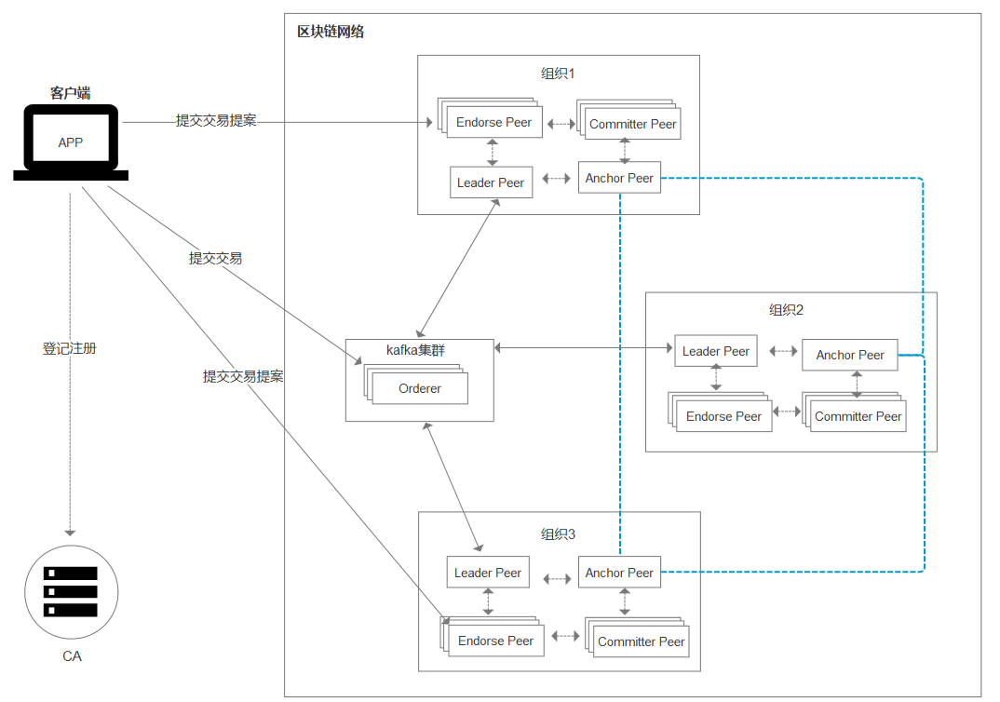
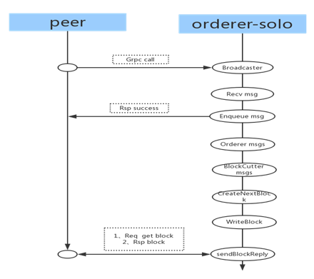

## 1. Fabric梳理

### 1.1 fabric网络的搭建过程

1. 生成节点证书

   ```shell
   # 1. 编写组织信息的配置文件, 该文件中声明每个组织有多少个节点, 多少用户
   #     在这个配置文件中声明了每个节点访问的地址(域名)
   #     一般命名为crypto-config.yaml
   $ cryptogen generate --config=xxx.yaml
   ```

2. 生成创始块文件和通道文件（创始块文件是给order节点用的，查看docker-compose.yaml文件：RDERER_GENERAL_GENESISMETHOD=file
   ORDERER_GENERAL_GENESISFILE=/var/hyperledger/orderer/orderer.genesis.block）

   - 编写配置文件 - configtx.yaml

     - 配置组织信息
       - name
       - ID
       - msp
       - anchor peer
     - 排序节点设置
       - 排序算法( 共识机制) 
       - orderer节点服务器的地址
       - 区块如何生成
     - 对组织关系的概述
       - 当前组织中所有的信息  -> 生成创始块文件
       - 通道信息    -> 生成通道文件 或者 生成锚节点更新文件

   - 通过命令生成文件

     ```shell
     $ configtxgen -profile [从configtx.yaml->profiles->下属字段名] -outputxxxx
     ```

   - 创始块文件:  给排序节点使用了

     ```shell
     ORDERER_GENERAL_GENESISMETHOD=file
     ORDERER_GENERAL_GENESISFILE=/var/hyperledger/orderer/orderer.genesis.block
     ```

   - 通道文件:

     被一个可以操作peer节点的客户端使用该文件创建了通道, 得到一个 `通道名.block`

3. 编写 orderer节点对应的配置文件并启动检测

   - 编写配置文件

     ```yaml
     # docker-compose.yaml
     ```

   - 启动docker容器

     ```shell
     $ docker-compose up -d
     ```

   - 检测

     ```shell
     $ docker-compose ps
     ```

4. 编写peer节点对应的配置文件并启动检测；进入容器创建通道、当前节点加入到通道、安装链码、初始化  -> 一次就行

   ```yaml
   # docker-compose.yaml
    - 两个服务器
    	- peer
    	- cli
   ```

   启动容器

   ```shell
   $ docker-compose up -d
   ```

   检测

   ```shell
   $ docker-compose ps
   ```

   进入到客户端容器中

   ```shell
   $ docker exec -it cli bash
   ```

   - 创建通道
   - 当前节点加入到通道
   - 安装链码
   - 初始化  -> 一次就行


### 1.2 看图说话



- 客户端
  - 连接peer需要用户身份的账号信息, 可以连接到同组织的peer节点上
  - 客户端发起一笔交易
    - 会发送到参与背书的各个节点上
    - 参加背书的节点进行模拟交易
    - 背书节点将处理结果发送给客户端
    - 如果提案的结果都没有问题, 客户端将交易提交给orderer节点
    - orderer节点将交易打包，发送给各组织的leader节点
    - leader节点将打包数据同步到当前组织
    - 当前组织的提交节点将打包数据写入到区块中
- Fabric-ca-sever
  - 可以通过它动态创建用户
  - 网络中可以没有这个角色
- 组织
  - peer节点 -> 存储账本
  - 用户
- 排序节点
  - 对交易进行排序
    - 解决双花问题
  - 对交易打包，满足条件后，发送给各组织的leader节点
    - configtx.yaml（设置了所要满足的条件）
- peer节点
  - 背书节点
    - 进行交易的模拟, 将模拟结果返回给客户端
    - 客户端选择的, 客户端指定谁去进行模拟交易谁就是背书节点
  - 提交节点
    - 将orderer节点打包的数据, 加入到区块链中
    - 只要是peer节点, 就具有提交数据的能力
  - 主节点
    - 和orderer排序节点直接通信的节点
      - 从orderer节点处获取到打包数据
      - 将数据同步到当前组织的各个节点中
    - 只能有一个
      - 可以自己指定
      - 也可以通过fabric框架选择 -> 推荐使用
  - 锚节点
    - 代表当前组织和其他组织通信的节点
    - 只能有一个

## 2. Fabric中的共识机制

> 交易必须按照发生的顺序写入分类帐，尽管它们可能位于网络中不同的参与者组之间。为了实现这一点，必须建立交易的顺序，并且必须建立一种拒绝错误（或恶意）插入分类帐的坏交易的方法。
>
> 在分布式分类帐技术中，共识渐渐已成为单一功能中特定算法的代名词。然而，共识不仅仅是简单地同意交易顺序，而是通过在整个交易流程中的基本作用，从提案和认可到订购，验证和承诺，在Hyperledger Fabric中强调了这种差异化。简而言之，<font color="red">共识被定义为对包含块的一组交易的正确性的全面验证</font>。
>
> Hyperledger Fabric共识机制，目前包括SOLO，Kafka，以及未来可能要使用的PBFT（实践拜占庭容错）、SBFT（简化拜占庭容错）

### 2.1 Solo

> <font color="red">SOLO机制是一个非常容易部署的非生产环境的共识排序节点</font>。它由一个为所有客户服务的单一节点组成，所以不需要“共识”，因为只有一个中央权威机构。相应地没有高可用性或可扩展性。这使得独立开发和测试很理想，但不适合生产环境部署。orderer-solo模式作为单节点通信模式，所有从peer收到的消息都在本节点进行排序与生成数据块。
>
> 客户端通过GRPC发起通信，与Orderer连接成功之后，便可以向Orderer发送消息。Orderer通过Recv接口接收Peer发送过来的消息，Orderer将接收到的消息生成数据块，并将数据块存入ledger，peer通过deliver接口从orderer中的ledger获取数据块。




### 2.2 Kafka

> Katka是一个分布式消息系统，由LinkedIn使用scala编写，用作LinkedIn的活动流（Activitystream)和运营数据处理管道（Pipeline）的基础。具有高水平扩展和高吞吐量。
>
> 在Fabric网络中，数据是由Peer节点提交到Orderer排序服务，而Orderer相对于Kafka来说相当于上游模块，且Orderer还兼具提供了对数据进行排序及生成符合配置规范及要求的区块。而使用上游模块的数据计算、统计、分析，这个时候就可以使用类似于Kafka这样的分布式消息系统来协助业务流程。
>
> 有人说Kafka是一种共识模式，也就是说平等信任，所有的HyperLedger Fabric网络加盟方都是可信方，因为消息总是均匀地分布在各处。但具体生产使用的时候是依赖于背书来做到确权，相对而言，Kafka应该只能是一种启动Fabric网络的模式或类型。
>
> Zookeeper一种在分布式系统中被广泛用来作为分布式状态管理、分布式协调管理、分布式配置管理和分布式锁服务的集群。Kafka增加和减少服务器都会在Zookeeper节点上触发相应的事件，Kafka系统会捕获这些事件，进行新一轮的负载均衡，客户端也会捕获这些事件来进行新一轮的处理。
>
> Orderer排序服务是Fablic网络事务流中的最重要的环节，也是所有请求的点，它并不会立刻对请求给予回馈，一是因为生成区块的条件所限，二是因为依托下游集群的消息处理需要等待结果。

## 3. kafka集群

### 3.1 生成节点证书

- 配置文件

  ```yaml
  
  ```


### 3.2 生成创始块文件和通道文件

-  编写配置文件 - configtx.yaml

  ```yaml
  
  ---
  ################################################################################
  #
  #   Section: Organizations
  #
  #   - This section defines the different organizational identities which will
  #   be referenced later in the configuration.
  #
  ################################################################################
  Organizations:
      - &OrdererOrg
          Name: OrdererOrg
          ID: OrdererMSP
          MSPDir: crypto-config/ordererOrganizations/example.com/msp
  
      - &OrgGo
          Name: OrgGoMSP
          ID: OrgGoMSP
          MSPDir: crypto-config/peerOrganizations/orggo.example.com/msp
          AnchorPeers:
              - Host: peer0.orggo.example.com
                Port: 7051
  
      - &OrgCpp
          Name: OrgCppMSP
          ID: OrgCppMSP
          MSPDir: crypto-config/peerOrganizations/orgcpp.example.com/msp
          AnchorPeers:
              - Host: peer0.orgcpp.example.com
                Port: 7051
  
  ################################################################################
  #
  #   SECTION: Capabilities
  #
  ################################################################################
  Capabilities:
      Global: &ChannelCapabilities
          V1_1: true
      Orderer: &OrdererCapabilities
          V1_1: true
      Application: &ApplicationCapabilities
          V1_2: true
  
  ################################################################################
  #
  #   SECTION: Application
  #
  ################################################################################
  Application: &ApplicationDefaults
      Organizations:
  
  ################################################################################
  #
  #   SECTION: Orderer
  #
  ################################################################################
  Orderer: &OrdererDefaults
      # Available types are "solo" and "kafka"
      OrdererType: kafka
      Addresses: # 排序节点的地址
          - orderer0.example.com:7050
          - orderer1.example.com:7050
          - orderer2.example.com:7050
  
      BatchTimeout: 2s
      BatchSize:
          MaxMessageCount: 10
          AbsoluteMaxBytes: 99 MB
          PreferredMaxBytes: 512 KB
      Kafka:
          Brokers:
              - 192.168.247.201:9092
              - 192.168.247.202:9092
              - 192.168.247.203:9092
              - 192.168.247.204:9092
      Organizations:
  
  ################################################################################
  #
  #   Profile
  #
  ################################################################################
  Profiles:
  
      TwoOrgsOrdererGenesis:
          Capabilities:
              <<: *ChannelCapabilities
          Orderer:
              <<: *OrdererDefaults
              Organizations:
                  - *OrdererOrg
              Capabilities:
                  <<: *OrdererCapabilities
          Consortiums:
              SampleConsortium:
                  Organizations:
                      - *OrgGo
                      - *OrgCpp
      TwoOrgsChannel:
          Consortium: SampleConsortium
          Application:
              <<: *ApplicationDefaults
              Organizations:
                  - *OrgGo
                  - *OrgCpp
              Capabilities:
                  <<: *ApplicationCapabilities
  
  ```

- 通过configtx.yaml生成创始块和通道文件

  ```shell
  # 生成创始块
  $ configtxgen -profile TwoOrgsOrdererGenesis -outputBlock ./genesis.block
  # 生成通道
  $ configtxgen -profile TwoOrgsChannel -outputCreateChannelTx ./channel.tx -channelID testchannel
  ```

### 3.3 配置zookeeper服务器

- 如何配置, 如何编写配置文件

  > ZOO_MY_ID=1 -> zookeeper服务器在集群中的ID, 这是唯一的, 范围: 1-255
  >
  > ZOO_SERVERS -> zookeeper服务器集群的服务器列表

- 配置文件编写

  - zookeeper1

    ```yaml
    version: '2'
    services:
      zookeeper1: # 服务器名, 自己起
        container_name: zookeeper1 # 容器名, 自己起
        hostname: zookeeper1	# 访问的主机名, 自己起, 需要和IP有对应关系
        image: hyperledger/fabric-zookeeper:latest
        restart: always	# 指定为always
        environment:
          # ID在集合中必须是唯一的并且应该有一个值，在1和255之间。
          - ZOO_MY_ID=1
          # server.x=hostname:prot1:port2
          - ZOO_SERVERS=server.1=zookeeper1:2888:3888 server.2=zookeeper2:2888:3888 server.3=zookeeper3:2888:3888
        ports:
          - 2181:2181
          - 2888:2888
          - 3888:3888
        extra_hosts:
          - "zookeeper1:192.168.24.201" #双引号一定要加，都加
          - zookeeper2:192.168.24.202
          - zookeeper3:192.168.24.203
          - kafka1:192.168.24.204
          - kafka2:192.168.24.205
          - kafka3:192.168.24.206
          - kafka4:192.168.24.207
    ```

  - zookeep2

    ```yaml
    # zookeeper2.yaml
    version: '2'
    services:
      zookeeper2: # 服务器名, 自己起，也可以叫zookeeper1（因为位于两台主机上，互不相干）
        container_name: zookeeper2 # 容器名, 自己起
        hostname: zookeeper2	# 访问的主机名, 自己起, 需要和IP有对应关系
        image: hyperledger/fabric-zookeeper:latest
        restart: always	# 指定为always
        environment:
          # ID在集合中必须是唯一的并且应该有一个值，在1和255之间。
          - ZOO_MY_ID=2
          # server.x=hostname:prot1:port2
          - ZOO_SERVERS=server.1=zookeeper1:2888:3888 server.2=zookeeper2:2888:3888 server.3=zookeeper3:2888:3888
        ports:
          - 2181:2181
          - 2888:2888
          - 3888:3888
        extra_hosts:
          - zookeeper1:192.168.24.201
          - zookeeper2:192.168.24.202
          - zookeeper3:192.168.24.203
          - kafka1:192.168.24.204
          - kafka2:192.168.24.205
          - kafka3:192.168.24.206
          - kafka4:192.168.24.207
    ```

  - zookeeper3

    ```yaml
    # zookeeper3.yaml
    version: '2'
    services:
      zookeeper3: # 服务器名, 自己起
        container_name: zookeeper3 # 容器名, 自己起
        hostname: zookeeper3	# 访问的主机名, 自己起, 需要和IP有对应关系
        image: hyperledger/fabric-zookeeper:latest
        restart: always	# 指定为always
        environment:
          # ID在集合中必须是唯一的并且应该有一个值，在1和255之间。
          - ZOO_MY_ID=3
          # server.x=hostname:prot1:port2
          - ZOO_SERVERS=server.1=zookeeper1:2888:3888 server.2=zookeeper2:2888:3888 server.3=zookeeper3:2888:3888
        ports:
          - 2181:2181
          - 2888:2888
          - 3888:3888
        extra_hosts:
          - zookeeper1:192.168.24.201
          - zookeeper2:192.168.24.202
          - zookeeper3:192.168.24.203
          - kafka1:192.168.24.204
          - kafka2:192.168.24.205
          - kafka3:192.168.24.206
          - kafka4:192.168.24.207
    ```

  ### 3.4 kafka集群

  - 配置文件

    > ​	环境变量: 
    >
    > KAFKA_BROKER_ID=1
    >
    > - 当前kafka服务器在集群中的ID, 非负数, 这个ID在集群中不能重复
    >
    > KAFKA_MIN_INSYNC_REPLICAS=2
    >
    > KAFKA_DEFAULT_REPLICATION_FACTOR=3
    >
    >  - 这两个都是备份KAFKA_MIN_INSYNC_REPLICAS要比默认备份数值小
    >  - KAFKA_DEFAULT_REPLICATION_FACTOR数值要比kafka服务器集群的个数小
    >  - kakfa集群个数 > KAFKA_DEFAULT_REPLICATION_FACTOR> KAFKA_MIN_INSYNC_REPLICAS
    >
    > KAFKA_ZOOKEEPER_CONNECT=zookeeper1:2181,zookeeper2:2181,zookeeper3:2181
    >
    > - 这个顺序和zookeeper配置文件中的ZOO_SERVERS配置顺序保持一致
    >
    > KAFKA_MESSAGE_MAX_BYTES=103809024 
    >
    >  -  在configtx.yaml配置文件中
    >  -  orderer -> batchsize-> AbsoluteMaxBytes
    >  -  99M * 1024 * 1024 + 1M的数据头
    >
    > KAFKA_REPLICA_FETCH_MAX_BYTES=103809024 # 99 * 1024 * 1024 B
    >
    >  - 这个值要小于等于KAFKA_MESSAGE_MAX_BYTES
    >
    > KAFKA_UNCLEAN_LEADER_ELECTION_ENABLE=false
    >
    > - 选择leader的时候是否采用共识机制
    >
    > KAFKA_LOG_RETENTION_MS=-1
    >
    > - 官方默认的关闭的, 设置为 -1 表示关闭
    > - 表示的log日志保持的时长
    >
    > KAFKA_HEAP_OPTS=-Xmx256M -Xms128M
    >
    > - kafka默认要求大小为1G   -> -Xmx1G -Xms1G
    > - -Xmx: 可以支配的最大内存
    > - -Xms: 默认已经分配的内存大小

### 3.4 kafka集群配置文件配置

- kafka1

  ```yaml
  # kafka1.yaml
  version: '2'
  
  services:
    kafka1: 
      container_name: kafka1
      hostname: kafka1
      image: hyperledger/fabric-kafka:latest
      restart: always
      environment:
        # broker.id
        - KAFKA_BROKER_ID=1
        - KAFKA_MIN_INSYNC_REPLICAS=2
        - KAFKA_DEFAULT_REPLICATION_FACTOR=3
        - KAFKA_ZOOKEEPER_CONNECT=zookeeper1:2181,zookeeper2:2181,zookeeper3:2181
        # 100 * 1024 * 1024 B
        - KAFKA_MESSAGE_MAX_BYTES=104857600 
        - KAFKA_REPLICA_FETCH_MAX_BYTES=104857600 # 100 * 1024 * 1024 B
        - KAFKA_UNCLEAN_LEADER_ELECTION_ENABLE=false
        - KAFKA_LOG_RETENTION_MS=-1
        - KAFKA_HEAP_OPTS=-Xmx256M -Xms128M
      ports:
        - 9092:9092
      extra_hosts:
        - "zookeeper1:192.168.24.201"
        - "zookeeper2:192.168.24.202"
        - zookeeper3:192.168.24.203
        - kafka1:192.168.24.204
        - kafka2:192.168.24.205
        - kafka3:192.168.24.206
        - kafka4:192.168.24.207
  ```

- kafka2

  ```yaml
  # kafka2.yaml
  version: '2'
  
  services:
    kafka2: 
      container_name: kafka2
      hostname: kafka2
      image: hyperledger/fabric-kafka:latest
      restart: always
      environment:
        # broker.id
        - KAFKA_BROKER_ID=2
        - KAFKA_MIN_INSYNC_REPLICAS=2
        - KAFKA_DEFAULT_REPLICATION_FACTOR=3
        - KAFKA_ZOOKEEPER_CONNECT=zookeeper1:2181,zookeeper2:2181,zookeeper3:2181
        # 100 * 1024 * 1024 B
        - KAFKA_MESSAGE_MAX_BYTES=104857600 
        - KAFKA_REPLICA_FETCH_MAX_BYTES=104857600 # 100 * 1024 * 1024 B
        - KAFKA_UNCLEAN_LEADER_ELECTION_ENABLE=false
        - KAFKA_LOG_RETENTION_MS=-1
        - KAFKA_HEAP_OPTS=-Xmx256M -Xms128M
      ports:
        - 9092:9092
      extra_hosts:
        - "zookeeper1:192.168.24.201"
        - "zookeeper2:192.168.24.202"
        - zookeeper3:192.168.24.203
        - kafka1:192.168.24.204
        - kafka2:192.168.24.205
        - kafka3:192.168.24.206
        - kafka4:192.168.24.207
  ```

- kafka3

  ```yaml
  # kafka3.yaml
  version: '2'
  
  services:
    kafka3: 
      container_name: kafka3
      hostname: kafka3
      image: hyperledger/fabric-kafka:latest
      restart: always
      environment:
        # broker.id
        - KAFKA_BROKER_ID=3
        - KAFKA_MIN_INSYNC_REPLICAS=2
        - KAFKA_DEFAULT_REPLICATION_FACTOR=3
        - KAFKA_ZOOKEEPER_CONNECT=zookeeper1:2181,zookeeper2:2181,zookeeper3:2181
        # 100 * 1024 * 1024 B
        - KAFKA_MESSAGE_MAX_BYTES=104857600 
        - KAFKA_REPLICA_FETCH_MAX_BYTES=104857600 # 100 * 1024 * 1024 B
        - KAFKA_UNCLEAN_LEADER_ELECTION_ENABLE=false
        - KAFKA_LOG_RETENTION_MS=-1
        - KAFKA_HEAP_OPTS=-Xmx256M -Xms128M
      ports:
        - 9092:9092
      extra_hosts:
        - "zookeeper1:192.168.24.201"
        - "zookeeper2:192.168.24.202"
        - zookeeper3:192.168.24.203
        - kafka1:192.168.24.204
        - kafka2:192.168.24.205
        - kafka3:192.168.24.206
        - kafka4:192.168.24.207
  ```

- kafka4

  ```yaml
  # kafka4.yaml
  version: '2'
  
  services:
    kafka4: 
      container_name: kafka4
      hostname: kafka4
      image: hyperledger/fabric-kafka:latest
      restart: always
      environment:
        # broker.id
        - KAFKA_BROKER_ID=4
        - KAFKA_MIN_INSYNC_REPLICAS=2
        - KAFKA_DEFAULT_REPLICATION_FACTOR=3
        - KAFKA_ZOOKEEPER_CONNECT=zookeeper1:2181,zookeeper2:2181,zookeeper3:2181
        # 100 * 1024 * 1024 B
        - KAFKA_MESSAGE_MAX_BYTES=104857600 
        - KAFKA_REPLICA_FETCH_MAX_BYTES=104857600 # 100 * 1024 * 1024 B
        - KAFKA_UNCLEAN_LEADER_ELECTION_ENABLE=false
        - KAFKA_LOG_RETENTION_MS=-1
        - KAFKA_HEAP_OPTS=-Xmx256M -Xms128M
      ports:
        - 9092:9092
      extra_hosts:
        - "zookeeper1:192.168.24.201"
        - "zookeeper2:192.168.24.202"
        - zookeeper3:192.168.24.203
        - kafka1:192.168.24.204
        - kafka2:192.168.24.205
        - kafka3:192.168.24.206
        - kafka4:192.168.24.207
  ```

## 4. orderer集群

### 4.1 相关配置项

> ORDERER_KAFKA_RETRY_LONGINTERVAL=10s
> ORDERER_KAFKA_RETRY_LONGTOTAL=100s
>
> ORDERER_KAFKA_RETRY_SHORTINTERVAL=1s
>
> ORDERER_KAFKA_RETRY_SHORTTOTAL=30s
>
> - 当前orderer连接kafka可能会失败, 失败之后会重试
>   - 第一阶段
>     - ORDERER_KAFKA_RETRY_SHORTINTERVAL每个这么长时间重试一次
>     - ORDERER_KAFKA_RETRY_SHORTTOTAL 总共重试的时间
>     - 第一阶段重试失败了
>   - 第二阶段
>     - ORDERER_KAFKA_RETRY_LONGINTERVAL每个这么长时间尝试连接一次
>     - ORDERER_KAFKA_RETRY_LONGTOTAL-> 第二阶段尝试的总时长
>
> ORDERER_KAFKA_VERBOSE=true
>
>  - orderer和kafka通信是否写log日志
>
> ORDERER_KAFKA_BROKERS=[192.168.24.204:9092,192.168.24.205:9092,192.168.24.206:9092,192.168.24.207:9092]
>
> - configtx.yaml
>   - orderer-> kafka->brokers

### 4.2 orderer集群配置

- orderer0

  ```yaml
  # orderer.yaml
  version: '2'
  
  services:
  
    orderer0.example.com:
      container_name: orderer0.example.com
      image: hyperledger/fabric-orderer:latest
      environment:
        - CORE_VM_DOCKER_HOSTCONFIG_NETWORKMODE=aberic_default
        - ORDERER_GENERAL_LOGLEVEL=debug
        - ORDERER_GENERAL_LISTENADDRESS=0.0.0.0
        - ORDERER_GENERAL_LISTENPORT=7050
        - ORDERER_GENERAL_GENESISMETHOD=file
        - ORDERER_GENERAL_GENESISFILE=/var/hyperledger/orderer/orderer.genesis.block
        - ORDERER_GENERAL_LOCALMSPID=OrdererMSP # configtx.yaml
        - ORDERER_GENERAL_LOCALMSPDIR=/var/hyperledger/orderer/msp
        # enabled TLS
        - ORDERER_GENERAL_TLS_ENABLED=true
        - ORDERER_GENERAL_TLS_PRIVATEKEY=/var/hyperledger/orderer/tls/server.key
        - ORDERER_GENERAL_TLS_CERTIFICATE=/var/hyperledger/orderer/tls/server.crt
        - ORDERER_GENERAL_TLS_ROOTCAS=[/var/hyperledger/orderer/tls/ca.crt]
        
        - ORDERER_KAFKA_RETRY_LONGINTERVAL=10s
        - ORDERER_KAFKA_RETRY_LONGTOTAL=100s
        - ORDERER_KAFKA_RETRY_SHORTINTERVAL=1s
        - ORDERER_KAFKA_RETRY_SHORTTOTAL=30s
        - ORDERER_KAFKA_VERBOSE=true
        - ORDERER_KAFKA_BROKERS=[192.168.24.204:9092,192.168.24.205:9092,192.168.24.206:9092,192.168.24.207:9092]
      working_dir: /opt/gopath/src/github.com/hyperledger/fabric
      command: orderer
      volumes:
        - ./channel-artifacts/genesis.block:/var/hyperledger/orderer/orderer.genesis.block
        - ./crypto-config/ordererOrganizations/example.com/orderers/orderer0.example.com/msp:/var/hyperledger/orderer/msp
        - ./crypto-config/ordererOrganizations/example.com/orderers/orderer0.example.com/tls/:/var/hyperledger/orderer/tls
      networks:
        default:
          aliases:
            - aberic
      ports:
        - 7050:7050
      extra_hosts:
        - kafka1:192.168.24.204
        - kafka2:192.168.24.205
        - kafka3:192.168.24.206
        - kafka4:192.168.24.207
  ```

- orderer1

  ```yaml
  # orderer1.yaml
  version: '2'
  
  services:
  
    orderer0.example.com:
      container_name: orderer0.example.com
      image: hyperledger/fabric-orderer:latest
      environment:
        - CORE_VM_DOCKER_HOSTCONFIG_NETWORKMODE=aberic_default
        - ORDERER_GENERAL_LOGLEVEL=debug
        - ORDERER_GENERAL_LISTENADDRESS=0.0.0.0
        - ORDERER_GENERAL_LISTENPORT=7050
        - ORDERER_GENERAL_GENESISMETHOD=file
        - ORDERER_GENERAL_GENESISFILE=/var/hyperledger/orderer/orderer.genesis.block
        - ORDERER_GENERAL_LOCALMSPID=OrdererMSP
        - ORDERER_GENERAL_LOCALMSPDIR=/var/hyperledger/orderer/msp
        # enabled TLS
        - ORDERER_GENERAL_TLS_ENABLED=false
        - ORDERER_GENERAL_TLS_PRIVATEKEY=/var/hyperledger/orderer/tls/server.key
        - ORDERER_GENERAL_TLS_CERTIFICATE=/var/hyperledger/orderer/tls/server.crt
        - ORDERER_GENERAL_TLS_ROOTCAS=[/var/hyperledger/orderer/tls/ca.crt]
        
        - ORDERER_KAFKA_RETRY_LONGINTERVAL=10s
        - ORDERER_KAFKA_RETRY_LONGTOTAL=100s
        - ORDERER_KAFKA_RETRY_SHORTINTERVAL=1s
        - ORDERER_KAFKA_RETRY_SHORTTOTAL=30s
        - ORDERER_KAFKA_VERBOSE=true
        - ORDERER_KAFKA_BROKERS=[192.168.24.204:9092,192.168.24.205:9092,192.168.24.206:9092,192.168.24.207:9092]
      working_dir: /opt/gopath/src/github.com/hyperledger/fabric
      command: orderer
      volumes:
        - ./channel-artifacts/genesis.block:/var/hyperledger/orderer/orderer.genesis.block
        - ./crypto-config/ordererOrganizations/example.com/orderers/orderer1.example.com/msp:/var/hyperledger/orderer/msp
        - ./crypto-config/ordererOrganizations/example.com/orderers/orderer1.example.com/tls/:/var/hyperledger/orderer/tls
      networks:
        default:
          aliases:
            - aberic
      ports:
        - 7050:7050
      extra_hosts:
        - kafka1:192.168.24.204
        - kafka2:192.168.24.205
        - kafka3:192.168.24.206
        - kafka4:192.168.24.207
  ```

- orderer2

  ```yaml
  # orderer2.yaml
  version: '2'
  
  services:
  
    orderer0.example.com:
      container_name: orderer0.example.com
      image: hyperledger/fabric-orderer:latest
      environment:
        - CORE_VM_DOCKER_HOSTCONFIG_NETWORKMODE=aberic_default
        - ORDERER_GENERAL_LOGLEVEL=debug
        - ORDERER_GENERAL_LISTENADDRESS=0.0.0.0
        - ORDERER_GENERAL_LISTENPORT=7050
        - ORDERER_GENERAL_GENESISMETHOD=file
        - ORDERER_GENERAL_GENESISFILE=/var/hyperledger/orderer/orderer.genesis.block
        - ORDERER_GENERAL_LOCALMSPID=OrdererMSP
        - ORDERER_GENERAL_LOCALMSPDIR=/var/hyperledger/orderer/msp
        # enabled TLS
        - ORDERER_GENERAL_TLS_ENABLED=false
        - ORDERER_GENERAL_TLS_PRIVATEKEY=/var/hyperledger/orderer/tls/server.key
        - ORDERER_GENERAL_TLS_CERTIFICATE=/var/hyperledger/orderer/tls/server.crt
        - ORDERER_GENERAL_TLS_ROOTCAS=[/var/hyperledger/orderer/tls/ca.crt]
        
        - ORDERER_KAFKA_RETRY_LONGINTERVAL=10s
        - ORDERER_KAFKA_RETRY_LONGTOTAL=100s
        - ORDERER_KAFKA_RETRY_SHORTINTERVAL=1s
        - ORDERER_KAFKA_RETRY_SHORTTOTAL=30s
        - ORDERER_KAFKA_VERBOSE=true
        - ORDERER_KAFKA_BROKERS=[192.168.24.204:9092,192.168.24.205:9092,192.168.24.206:9092,192.168.24.207:9092]
      working_dir: /opt/gopath/src/github.com/hyperledger/fabric
      command: orderer
      volumes:
        - ./channel-artifacts/genesis.block:/var/hyperledger/orderer/orderer.genesis.block
        - ./crypto-config/ordererOrganizations/example.com/orderers/orderer2.example.com/msp:/var/hyperledger/orderer/msp
        - ./crypto-config/ordererOrganizations/example.com/orderers/orderer2.example.com/tls/:/var/hyperledger/orderer/tls
      networks:
        default:
          aliases:
            - aberic
      ports:
        - 7050:7050
      extra_hosts:
        - kafka1:192.168.24.204
        - kafka2:192.168.24.205
        - kafka3:192.168.24.206
        - kafka4:192.168.24.207
  ```


## 5. 集群的启动

> 启动顺序: zookeeper集群 -> kafka集群 -> orderer集群

### 5.1 zookeeper集群的启动

> zookeeper集群一共有三台主机

- 第一台zookeeper

  ```shell
  # 1. 进入到当前节点的工作目录, 在开始的时候创建的, 比如 ~/kafka
  $ cd ~/kafka
  # 2. 将写好的配置文件部署到当前主机的 ~/kafka目录   zookeeper1.yaml
  # 3. 启动docker 通过docker-compose
  $ docker-compose -f zookeeper1.yaml up -d
  ```

- 第2台zookeeper

  ```shell
  # 1. 进入到当前节点的工作目录, 在开始的时候创建的, 比如 ~/kafka
  $ cd ~/kafka
  # 2. 将写好的配置文件部署到当前主机的 ~/kafka目录   zookeeper2.yaml
  # 3. 启动docker 通过docker-compose
  $ docker-compose -f zookeeper2.yaml up -d
  ```

- 第3台zookeeper

  ```shell
  # 1. 进入到当前节点的工作目录, 在开始的时候创建的, 比如 ~/kafka
  $ cd ~/kafka
  # 2. 将写好的配置文件部署到当前主机的 ~/kafka目录   zookeeper3.yaml
  # 3. 启动docker 通过docker-compose
  $ docker-compose -f zookeeper3.yaml up -d
  ```

### 5.2 启动kafka集群

- 卡夫卡1

  ```shell
  # 1. 进入到当前节点的工作目录, 在开始的时候创建的, 比如 ~/kafka
  $ cd ~/kafka
  # 2. 将写好的配置文件部署到当前主机的 ~/kafka目录   kafka1.yaml
  # 3. 启动docker 通过docker-compose
  $ docker-compose -f kafka1.yaml up -d
  $ docker-compose -f kafka1.yaml ps
  ```

- 按照上述方式分别启动kafka 2, 3, 4

### 5.3 orderer集群的启动

- orderer0

  ```yaml
  # 1. 进入到当前节点的工作目录, 在开始的时候创建的, 比如 ~/kafka
  $ cd ~/kafka
  # 2. 将写好的配置文件部署到当前主机的 ~/kafka目录   
  # 3. 需要将开始时候生成的证书文件和创始块文件部署到orderer0主机上
  	- 将第3.1生成的crypto-conf中拷贝到当前目录
  	- 将genesis.block拷贝到当前目录
  	- 根据配置文件中卷挂载的路径对上述文件目录进行修改即可
  # 4. 启动docker 通过docker-compose
  $ docker-compose -f orderer0 up -d
  $ docker-compose -f orderer0 ps
  ```

- orderer1

  ```shell
  # 1. 进入到当前节点的工作目录, 在开始的时候创建的, 比如 ~/kafka
  $ cd ~/kafka
  # 2. 将写好的配置文件部署到当前主机的 ~/kafka目录   
  # 3. 需要将开始时候生成的证书文件和创始块文件部署到orderer1主机上
  	- 将第3.1生成的crypto-conf中拷贝到当前目录
  	- 将genesis.block拷贝到当前目录
  	- 根据配置文件中卷挂载的路径对上述文件目录进行修改即可
  # 4. 启动docker 通过docker-compose
  $ docker-compose -f orderer1 up -d
  $ docker-compose -f orderer1 ps
  ```


- orderer2

  ```shell
  # 1. 进入到当前节点的工作目录, 在开始的时候创建的, 比如 ~/kafka
  $ cd ~/kafka
  # 2. 将写好的配置文件部署到当前主机的 ~/kafka目录   
  # 3. 需要将开始时候生成的证书文件和创始块文件部署到orderer2主机上
  	- 将第3.1生成的crypto-conf中拷贝到当前目录
  	- 将genesis.block拷贝到当前目录
  	- 根据配置文件中卷挂载的路径对上述文件目录进行修改即可
  # 4. 启动docker 通过docker-compose
  $ docker-compose -f orderer2 up -d
  $ docker-compose -f orderer2 ps
  ```
